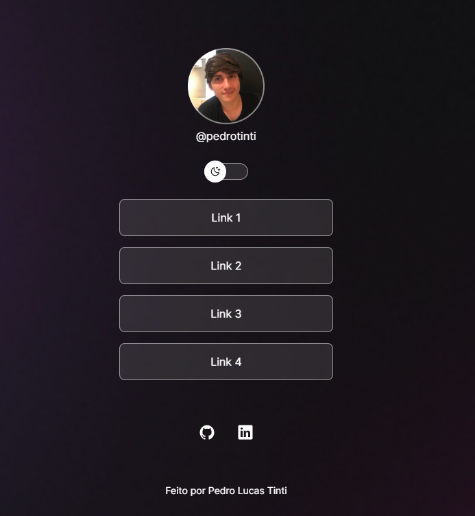
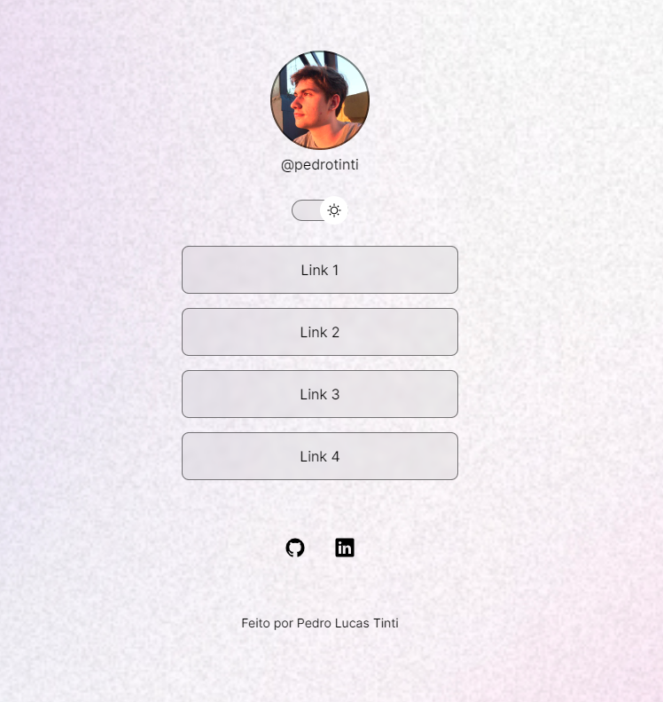

<h1 align="center">💻 Projeto Devlinks</h1>

O DevLinks é um agregador de links para usar como cartão de visitas online.  

  <a href="#-layout">Layout</a>&nbsp;&nbsp;&nbsp;|&nbsp;&nbsp;&nbsp;  
  <a href="#-tecnologias">Tecnologias</a>&nbsp;&nbsp;&nbsp;|&nbsp;&nbsp;&nbsp;

## Layout

<h3 align="center">Modelo escuro</h3>

  

 

<h3 align="center">Modelo claro</h3>

  

## 🚀 Tecnologias

Esse projeto foi desenvolvido com as seguintes tecnologias:

- HTML e CSS
- JavaScript
- Git e Github
- Figma
